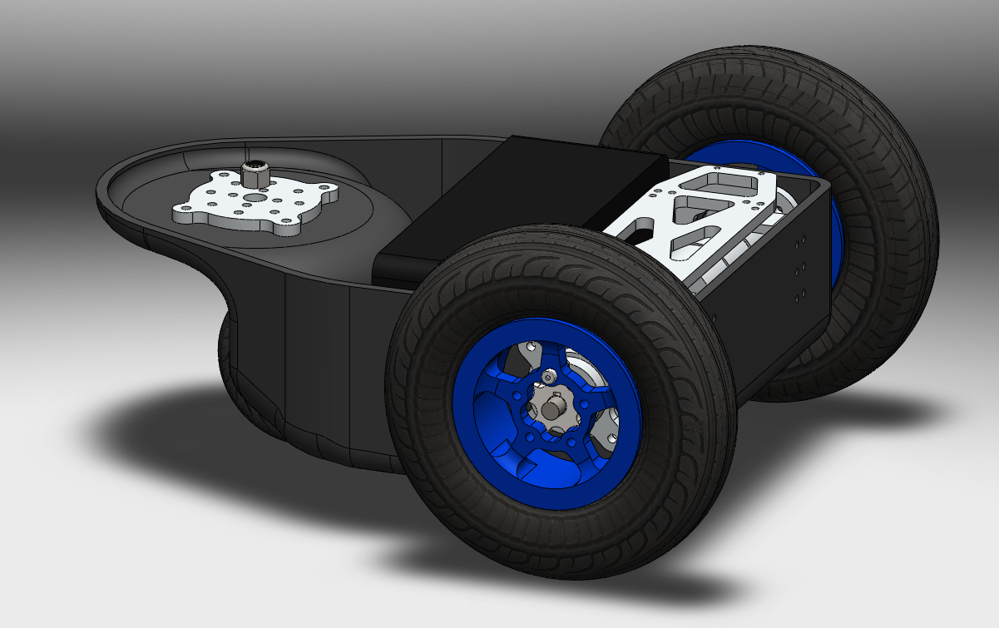
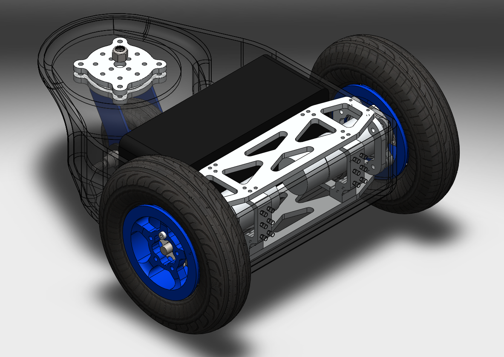
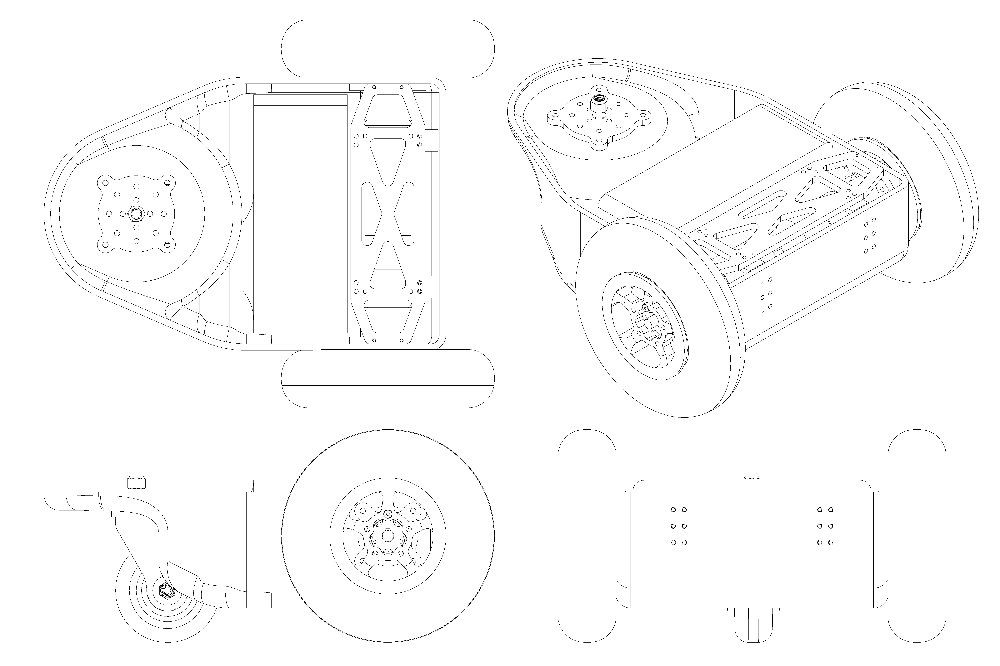
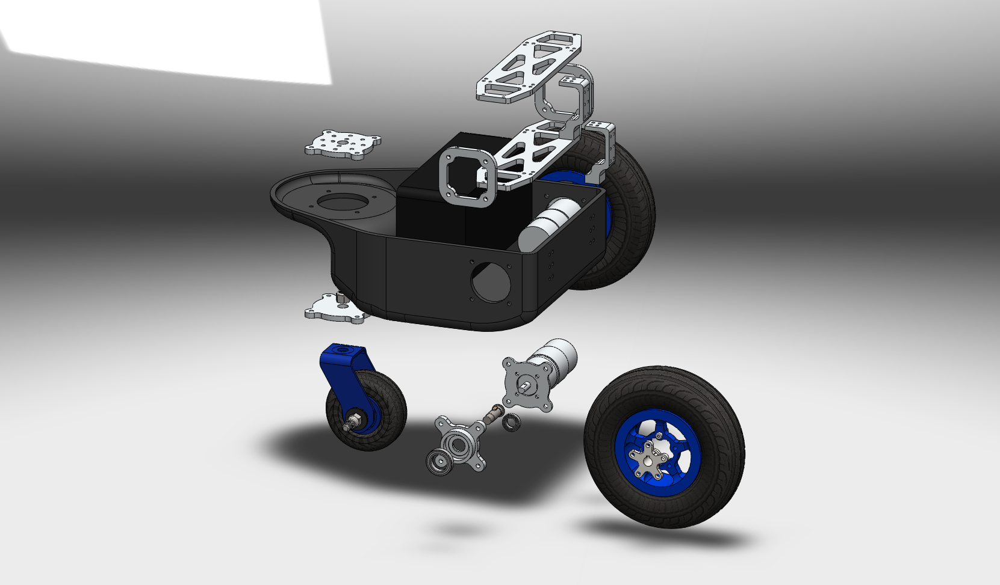
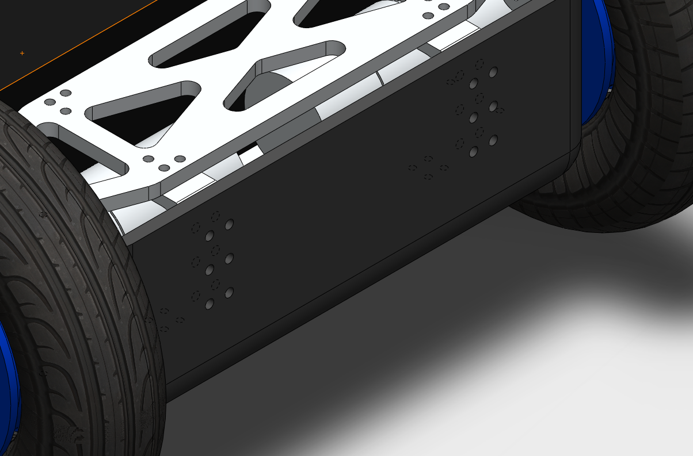
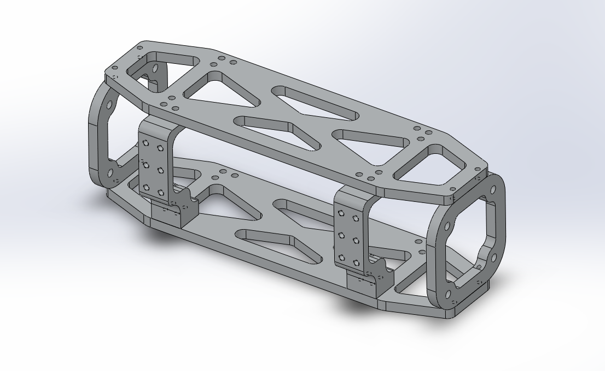
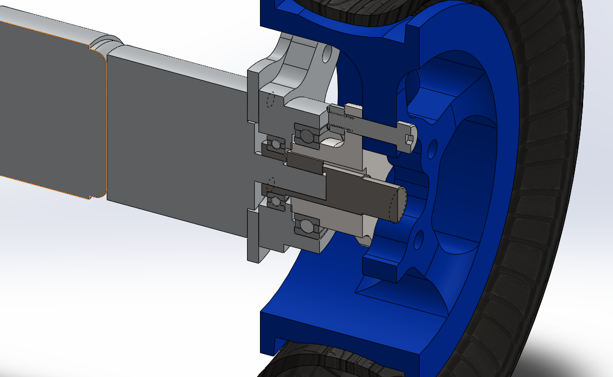
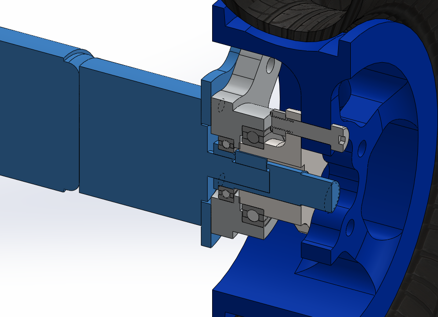
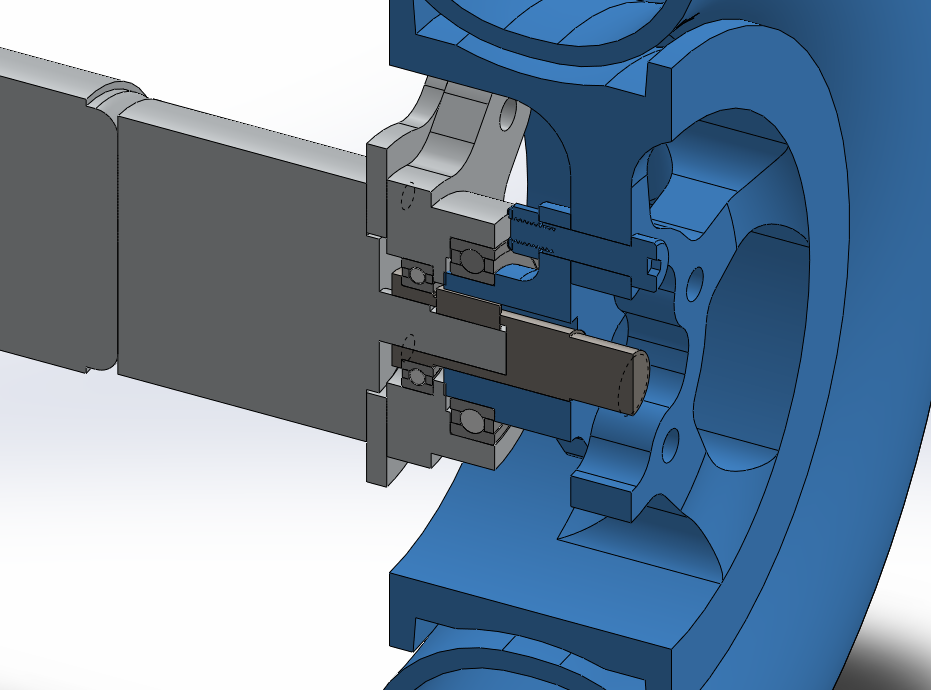

# roboMEP-mech

Robot: **M**odular **E**xtensible **P**latform, mechanical core.

A general-purpose intermediate-size wheeled robot with rapid development capabilities. Was originally intended for an autonomous lawnmower competition, which was canceled, and evolved from there. Highly modular, very flexible. Lacking on documentation. It was a busy time!

## Without the swappable top

Semi-monocoque design with front and rear load-bearing accessory frames.

The full lower assembly:

Shown with transparent skin:

Orthographic+isometric projection:

And exploded -- note the low part count and simple construction:

## Accessory frames

Front and rear have easily-accessible load-bearing hole patterns for accessories. Rear mounts vertically only, while front includes front-facing hole patterns for sensors, actuators, etc.

The front frame and front-facing hardmounts:

Close-up of the front frame, removed from the robot assembly:

## Highly modular design

All major subsystems can be iterated with at most two adapter part redesigns.

The full motive subsystem, cutaway:

Show with the swappable motor module highlighted:

And with the swappable wheel module highlighted:

